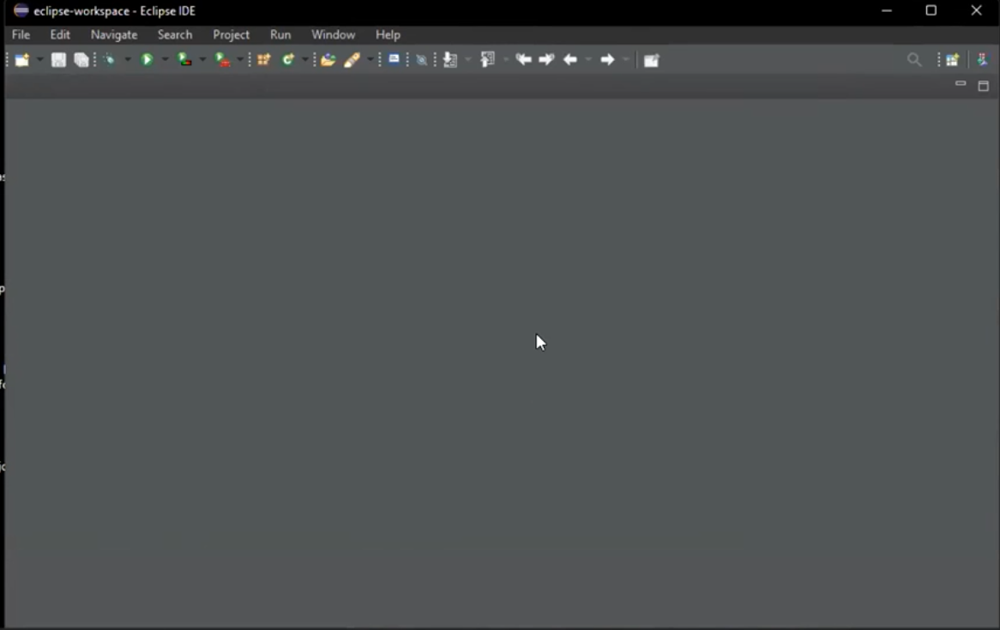
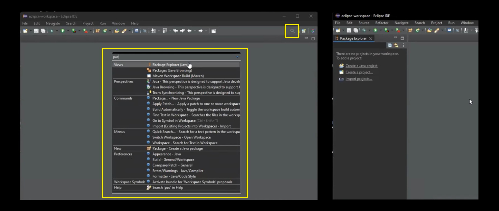

# Operators and Variables

## Eclipse Installation

1. Install **Eclipse IDE for Java Developers**.
2. Open Eclipse IDE.

    _If by chance, you see a blank screen like below, `Project Explorer` is not open._

    

    _Then, you can open it by clicking on the search icon and search for `package explorer` and hit enter. This will open package explorer on the right sidebar._

    

3. Create a new project:

    ```text
    File > New Project > Java Project
    ```

    Enter the name of your project (_Don't use spaces_).

    - Use default location
    - **JRE**: Use an execution environment JRE: `JavaSE 11`
    - **Project Layout**: Create seperate folders for sources and class files
    - **Module**: Uncheck create `module-info.java` file
    - Finish

## VS Code Installation

1. Create a directory where you want to save all your codes. Open that folder using vscode.
2. Create a task:

    ```sh
    Terminal > Configure Tasks > Create task.json file from template > Others
    # and it will create vscode/tasks.json file
    ```

3. The tasks should look like this for proper execution of the java files (especially the ones present in sub-folders, `-cp` setting classpath is very important).

    ```json
    {
        // See https://go.microsoft.com/fwlink/?LinkId=733558
        // for the documentation about the tasks.json format
        "version": "2.0.0",
        "tasks": [
            {
                "label": "compile-and-run-java",
                "type": "shell",
                "command": "javac '${file}' && java -cp '${fileDirname}' ${fileBasenameNoExtension}",
                "group": {
                    "kind": "build",
                    "isDefault": true
                }
            }
        ]
    }
    ```

4. Now you're good to go. Open any file and press `Ctrl + Shift + B` to run the program in the shell.
