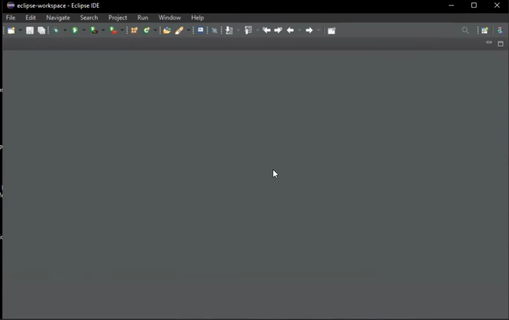
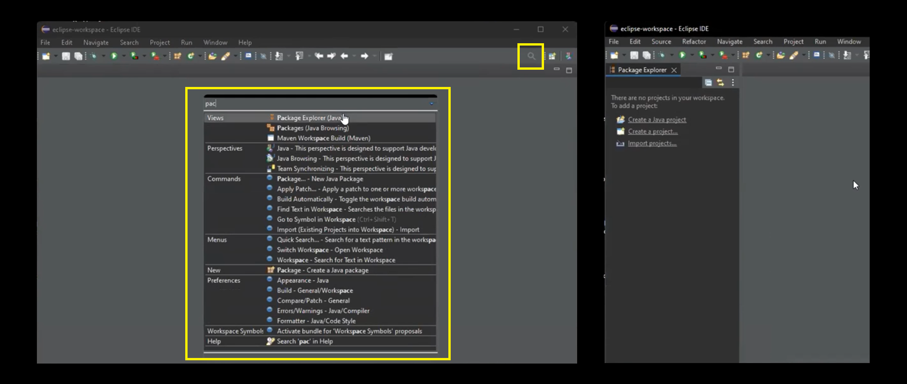

# Coding Blocks Java

## Installation & Running Java Guide

### Eclipse Installation

1. Install **Eclipse IDE for Java Developers**.
2. Open Eclipse IDE.

    _If by chance, you see a blank screen like below, `Project Explorer` is not open._

    

    _Then, you can open it by clicking on the search icon and search for `package explorer` and hit enter. This will open package explorer on the right sidebar._

    

3. Create a new project:

    ```text
    File > New Project > Java Project
    ```

    Enter the name of your project (_Don't use spaces_).

    - Use default location
    - **JRE**: Use an execution environment JRE: `JavaSE 11`
    - **Project Layout**: Create seperate folders for sources and class files
    - **Module**: Uncheck create `module-info.java` file
    - Finish

### VS Code Installation

1. Create a directory where you want to save all your codes. Open that folder using vscode.
2. Create a task:

    ```sh
    Terminal > Configure Tasks > Create task.json file from template > Others
    # and it will create vscode/tasks.json file
    ```

3. The tasks should look like this for proper execution of the java files (especially the ones present in sub-folders, `-cp` setting classpath is very important).

    ```json
    {
        // See https://go.microsoft.com/fwlink/?LinkId=733558
        // for the documentation about the tasks.json format
        "version": "2.0.0",
        "tasks": [
            {
                "label": "compile-and-run-java",
                "type": "shell",
                "command": "javac '${file}' && java -cp '${fileDirname}' ${fileBasenameNoExtension}",
                "group": {
                    "kind": "build",
                    "isDefault": true
                }
            }
        ]
    }
    ```

4. Now you're good to go. Open any file and press `Ctrl + Shift + B` to run the program in the shell.

> **NOTE:** Wouldn't work in case the file is not default package.

### Using `run-java.sh`

you can run any java code using the `run-java.sh` bash script. Please note that you need to specify `package` name at the top of every file and if using a `public` class then the name of the file should be same as the class name.

```sh
#!/bin/bash

if [ $# -ne 1 ]; then
  echo "Usage: $0 <Java file path>"
  echo "Example: $0 code/zzTest/Test.java"
  exit 1
fi

JAVA_FILE="$1"

if [ ! -f "$JAVA_FILE" ]; then
  echo "Error: File not found: $JAVA_FILE"
  exit 1
fi

# Compile the Java file
javac "$JAVA_FILE"
if [ $? -ne 0 ]; then
  echo "Compilation failed."
  exit 1
fi

# Derive fully qualified class name
PACKAGE_PATH=$(dirname "$JAVA_FILE")
PACKAGE_PATH=${PACKAGE_PATH//\//.}  # Convert / to .
CLASS_NAME=$(basename "$JAVA_FILE" .java)
FQCN="${PACKAGE_PATH}.${CLASS_NAME}"

# echo "Running ${FQCN}..."
java "$FQCN"
```

And in the terminal, run the file using the below comand:

```sh
# Example:
./run_java.sh MyProgram.java
./run_java.sh src/com/example/MyClass.java
```


## How to Debug a Java program

To debug a java program, you need to compile the program using `-g` flag, it adds the neccessary debugging information.

> NOTE: you also need to update the code for input as once in debugging mode, jdb won't accept input to programs. It inteprets it command for itself.

```sh
javac -g Add.java
```

And then run the program using `jdb` and not `java`.

```sh
jdb Add
# or if it is a package
jdb code.L01.Add
```

Now you can refer to the commands to use the debugger.

```sh
# Add a breakpoint
stop at Add:4
# or if it is a package
stop at code.L01.Add:4

# you can add multiple breakpoints
stop at Add:6 # press enter
stop at Add:8 # press enter

# run the debugger
run

# to view all the local variables
# and their values
locals
```

You can now use JDB commands to debug the program. Here are some commonly used commands:

- `stop at <class>:<line>` - Sets a breakpoint at the specified line in the specified class.
- `stop in <class>.<method>` - Sets a breakpoint at the beginning of the specified method in the specified class.
- `run` - start the program execution. Type "run" at the JDB prompt to start the program execution. The program will run until the next breakpoint or until it completes.
- `locals` - Lists the local variables in the current frame.
- `list` - Lists the source code around the current execution point.
- `step` - step through the program execution one line at a time. Type "step" at the JDB prompt to execute the current line and stop at the next line. If the current line contains a method call, JDB will step into the method and stop at the first line of the method.
- `next` - step through the program execution one line at a time, but skip over method calls. Type "next" at the JDB prompt to execute the current line and stop at the next line. If the current line contains a method call, JDB will execute the method call and stop at the next line after the method call.
- `breakpoint` - set a breakpoint at a specified line number or method. Type `stop at <className>:<lineNumber>` at the JDB prompt followed by the line number or method name to set a breakpoint. For example, to set a breakpoint at line 4 of the "HelloWorld" class, type "stop at HelloWorld:4". You can also set a breakpoint at a method by specifying the method name instead of the line number.

    You can set as many breakpoints as needed using these commands. To view a list of all currently set breakpoints, use the `clear` or `stop` command without any arguments.

- `print <expression>` - print the value of a variable. Type "print " at the JDB prompt followed by the variable name to print the value of the variable. For example, to print the value of the "args" array variable in the main method, type "print args".
- `where` - shows you the stack trace of the current thread, and the topmost method denotes where we currently are.
    - `up / down` can be used to traverse the stack, and view the values of the local variables using the `locals` command. (Mind it that `up` goes down the visible stack).
- `cont` - Continues the execution of the program until the next breakpoint or until the program completes.
- `classes` - Lists all loaded classes.
- `methods <class>` - Lists all methods in the specified class.
- `thread` - Lists all threads and their current status.
- `suspend` - Suspends all threads.
- `resume` - Resumes all threads.
- `help` - Displays a list of available JDB commands.
- `exit` - Exits JDB.

## Contests Links

1. [Assignment 1 | Patterns | L06_Loops](https://hack.codingblocks.com/app/contests/3988)
2. [Assignment 2| Number System & Data Types 1 | L09_Data_Types_3](https://hack.codingblocks.com/app/contests/4035)